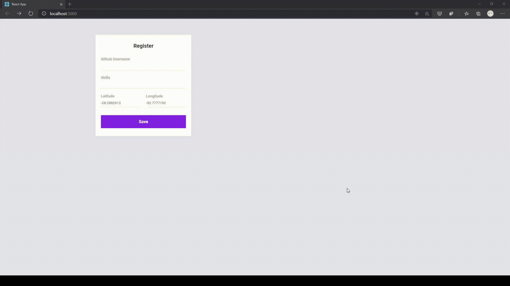

# DevRadar

Toy React app developed as part of a 1-week challenge. It comprises a web page where developers can register their skills, and a phone app where they can be found and contacted for work based on skills and geographic proximity.

# See it in action:
</img>

</img>

# Installation
Make sure to set it to run on the correct ip: change 'baseURL' on src/services/api.js to your computer's address.

On every folder run:
```yarn install; yarn add axios; yarn start```

# Dependencies
*Expo* app on your phone to run the app.

Expo CLI on your PC:
```yarn global add install expo-cli```
